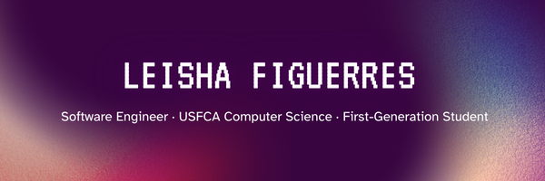

  

# Hello there 👋, I’m Leisha Figuerres  
### Software Engineer · USF Computer Science · First-Generation Student  

I grew up on the small island of **Lāna‘i, Hawai‘i** 🌺. I'm a **Computer Science major at the University of San Francisco** who loves coding, problem-solving, and building projects from the ground up. 💻✨ I focus on backend engineering, full-stack development, and systems that make life simpler for real people.

I’m passionate about creating reliable software, understanding how things work under the hood, and solving problems with clarity and intention.

---

### 🛠️ Technologies & Tools

#### **Languages**

  
  
  
  
  

#### **Frontend**

  
  
  
  

#### **Backend / Infra**

  
  
  
  
  
  

#### **Tools**

  
  

---

## 📫 Connect with Me

  
  

